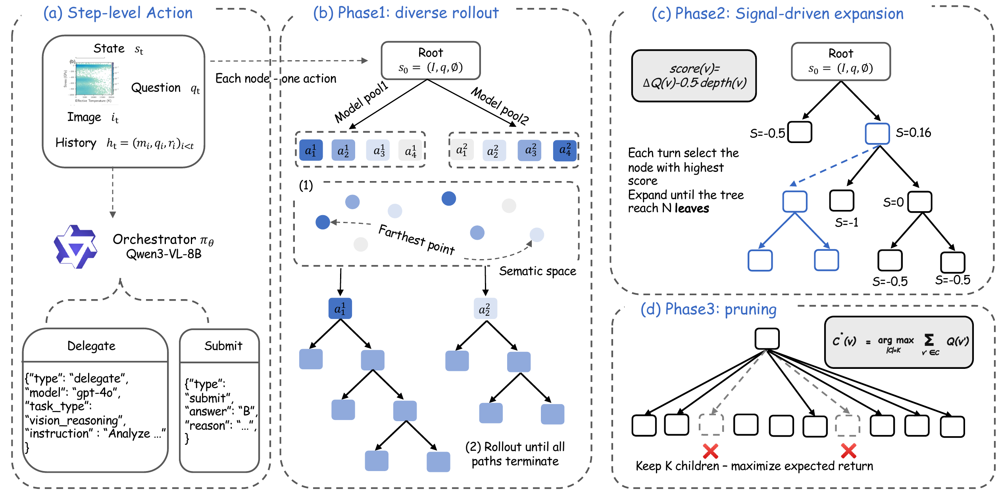

<h1 align="center">SciOrch: Learning to Orchestrate Expert LLMs for Solving Frontier Multimodal Scientific Reasoning Tasks</h1>

<p align="center">
  Implementation for the paper "SciOrch: Learning to Orchestrate Expert LLMs for Solving Frontier Multimodal Scientific Reasoning Tasks".
</p>

<hr>

<p align="center">
  
</p>

## Install

```bash
pip install -e .
```

## Environment Setup

Set the following environment variables before running:

```bash
# OpenAI-compatible endpoint for the expert / sub-agent model calls, used by the
# reasoning orchestrator, MCTS data generation, and the model-pool eval step.
# These match delegate_openai_*_env in the configs.
export base_url="https://your-openai-compatible-endpoint/v1"
export api_key="your-api-key"
```

The shipped configs run the main orchestrator on a local vLLM server
(`main_local_base_url`, key `EMPTY`), so only the sub-agent credentials above are
required.

## Prepare the Dataset

Download SGI / SFE / SuperGPQA from HuggingFace and build the train/test splits.
Outputs go to `data/` (`train_combined.json`, `test_combined.json`,
`all_combined.json`):

```bash
python scripts/build_dataset.py
```

The shared sub-agent model pool lives in `configs/models.yaml` and is referenced
by `sub_models` / `candidate_models` across the configs.

## Build Per-Task Model Pools (who solves what)

Before MCTS, run every candidate model over the **training set** to record which
models answer each task correctly vs. wrong. MCTS reads this to build, per task, a
pool of models capable of solving it. The sub-agent endpoint is read from
`base_url` / `api_key` (see Environment Setup); results are written per model under
`data/model_evaluations/`:

```bash
python scripts/run_model_eval.py \
  --dataset data/train_combined.json \
  --models configs/models.yaml \
  --output-dir data/model_evaluations
```

The MCTS configs read these evaluations via `shared.evaluation_dir`
(`configs/train_loop/generate.yaml`), which points at `data/model_evaluations`.

## Evaluation

Run the reasoning orchestrator on the **test set**. By default
`configs/reasoning.yaml` evaluates on `data/test_combined.json`:

```bash
python -m sciorch.cli.run_reasoning \
  --config configs/reasoning.yaml
```

## Training

Run the train–generate loop: each iteration generates MCTS data on the
**training set** and runs offline REINFORCE on it, driven by
`configs/train_loop/loop.yaml` (it serves the orchestrator with a local vLLM
server — see the config header for the per-iteration steps):

```bash
python scripts/train_loop.py \
  --config configs/train_loop/loop.yaml
```

